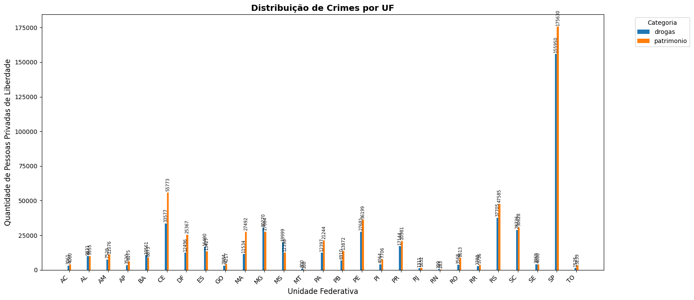
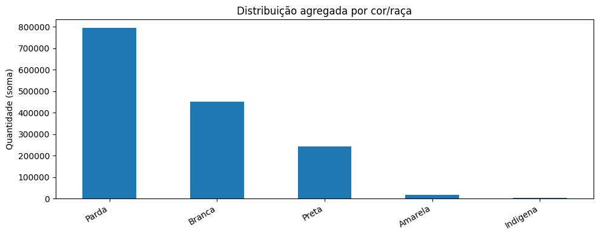
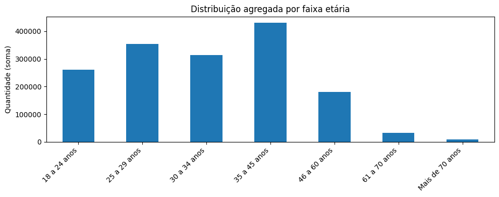
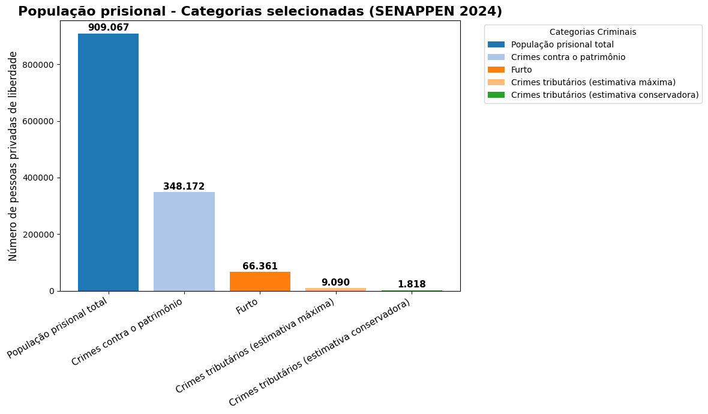

# 📊 Análise da Seletividade Penal Brasileira com Ciência de Dados

## 🎓 Trabalho de Conclusão de Curso

**Autor:** Cesar Augusto Pereira

**Curso:** Ciência de Dados e Inteligência Artificial

**Instituição:** Centro Universitário UniDomBosco

---

## 📖 Sobre o Projeto

Este projeto investiga a seletividade penal brasileira por meio da análise de dados públicos do Sistema Nacional de Informações Penais (SISDEPEN/SENAPPEN).

A pesquisa busca verificar a concentração do encarceramento em determinados grupos sociais e tipos penais, especialmente nos crimes patrimoniais, utilizando técnicas de Ciência de Dados para extração, tratamento, análise e visualização de dados.

---

## 🎯 Problema de Pesquisa

Existe concentração do encarceramento brasileiro em determinados grupos sociais e em determinados tipos penais, especialmente nos crimes patrimoniais, indicando padrões compatíveis com a hipótese da seletividade penal?

---

## 🔍 Objetivos

### Objetivo Geral

Investigar padrões de encarceramento no Brasil por meio de técnicas de Ciência de Dados aplicadas aos dados do SISDEPEN/SENAPPEN.

### Objetivos Específicos

- Realizar tratamento e limpeza dos dados.
- Identificar a distribuição da população prisional.
- Analisar a incidência dos crimes patrimoniais.
- Avaliar a representatividade do crime de furto no sistema prisional.
- Explorar características demográficas da população encarcerada.
- Produzir visualizações que auxiliem a compreensão dos resultados.

---

## 🗂 Estrutura do Projeto

```text
tcc-ciencia-dados-seletividade-penal

├── dados/
│   └── sisdepen.csv
│
├── notebooks/
│   └── TCC_Seletividade_Penal.ipynb
│
├── imagens/
│   ├── distribuicao_crimes.png
│   ├── perfil_racial.png
│   ├── faixa_etaria.png
│   └── populacao_prisional.png
│
├── requirements.txt
│
└── README.md
```

---

## 🛠 Tecnologias Utilizadas

<p align="center">


</p>

### Ferramentas Utilizadas

- Python
- Pandas
- NumPy
- Matplotlib
- Seaborn
- Jupyter Notebook
- Google Colab
- GitHub

---

## 📊 Principais Visualizações

### Distribuição por Tipo Penal



---

### Perfil Racial da População Prisional



---

### Distribuição por Faixa Etária



---

### Panorama da População Prisional



---

## 📈 Metodologia

A metodologia utilizada seguiu as seguintes etapas:

1. Coleta dos dados públicos do SISDEPEN/SENAPPEN.
2. Importação dos dados para ambiente Python.
3. Limpeza e tratamento das informações.
4. Padronização das variáveis.
5. Transformação dos dados para análise.
6. Construção de estatísticas descritivas.
7. Geração de gráficos e visualizações.
8. Interpretação dos resultados à luz da Criminologia Crítica.

---

## ▶️ Como Executar

### Pré-requisitos

```bash
pip install -r requirements.txt
```

### Execução

1. Abra o notebook no Google Colab.
2. Execute a primeira célula.
3. Realize o upload do arquivo `sisdepen_1_17_csv` quando solicitado.
4. Execute as demais células sequencialmente.
5. Analise os resultados e gráficos gerados.

---

## 📚 Base de Dados

Os dados utilizados neste projeto foram obtidos a partir de informações públicas disponibilizadas por:

- SISDEPEN
- SENAPPEN
- Ministério da Justiça e Segurança Pública

---

## ⚖ Fundamentação Teórica

A pesquisa dialoga principalmente com:

- Criminologia Crítica
- Sociologia do Controle Penal
- Política Criminal
- Ciência de Dados Aplicada ao Direito
- Estatística Descritiva

---

## ⚠ Limitações do Estudo

- Utilização de dados agregados.
- Dependência da qualidade dos dados públicos disponibilizados.
- Ausência de microdados individuais.
- Restrições inerentes às estatísticas oficiais.

---

## 🚀 Possíveis Expansões Futuras

- Análise temporal da população prisional.
- Clusterização dos estados brasileiros.
- Dashboards interativos.
- Modelos preditivos.
- Integração com dados do CNJ e IBGE.

---

## 📄 Licença

Projeto desenvolvido exclusivamente para fins acadêmicos como Trabalho de Conclusão de Curso em Ciência de Dados e Inteligência Artificial.

---

## 👨‍💻 Autor

**Cesar Augusto Pereira**

Advogado • Cientista de Dados em Formação • Pesquisador em Direito, Inteligência Artificial e Análise de Dados

GitHub: https://github.com/cesaraugustopereirabr

LinkedIn: https://www.linkedin.com/in/cesaraugustopereirabr/
